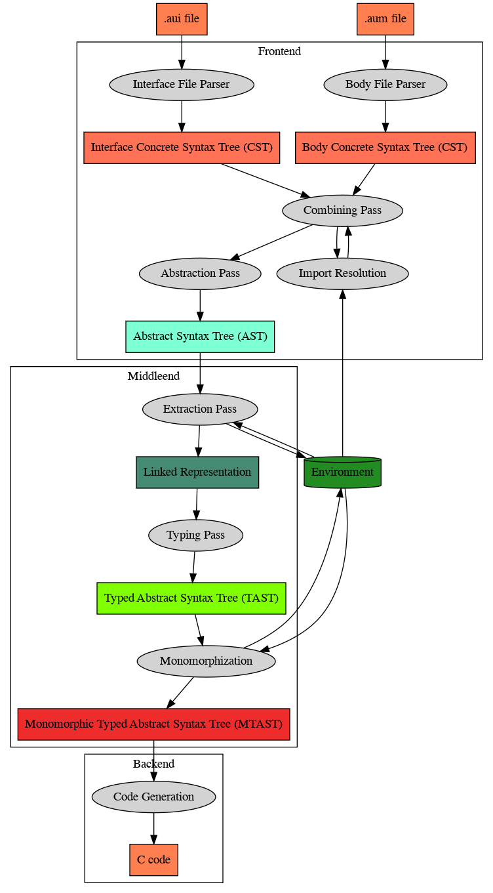

# How the Austral Compiler Works

This document is a walkthrough of every stage in the Austral bootstrapping
compiler's pipeline, from source to target.

# Overview

The overall pipeline looks like this:

# Parsing

Every Austral module is divided into two files: the module interface file and
the module body file.

Each one is parsed into a separate **CST** (concrete syntax tree) by the
functions in the `ParserInterface` module.

# Import Insertion Pass

Each of the module interface and module body are modified to have an implicit
import of all the symbols in the `Austral.Pervasive` module.

# Combining Pass

The combining pass takes the CST for the module interface and for the module
body and combines them into a single representation, where all declarations are
present and have visibility information derived from whether or not they appear
in the module interface.

# Extraction Pass

The extraction pass goes through a combined module and extracts its declarations
into the environment. The bodies of functions and methods are ignored.

# Typing Pass

The typing pass is the largest pass by volume: type checking happens here, and
the untyped AST is converted into a **TAST** (typed abstract syntax tree).

# Lifetime Analysis

[TODO]

# Body Extraction Pass

In the body extraction pass, the bodies of functions and instance methods are
extracted from a typed module instance and stored in the environment. We need
the bodies in the environment to instantiate generic functions in the
monomorphization pass.

# Monomorphization Pass

In the monomorphization pass, generic types and functions are instantiated into
concrete types.

# Code Generation

In the code generation pass, a monomorphized module is converted into a C
translation unit.

# Rendering

In the rendering pass, implemented in the `CRender` module, the C code AST is
rendered into C code which is dumped to a file for GCC/Clang to compile.
